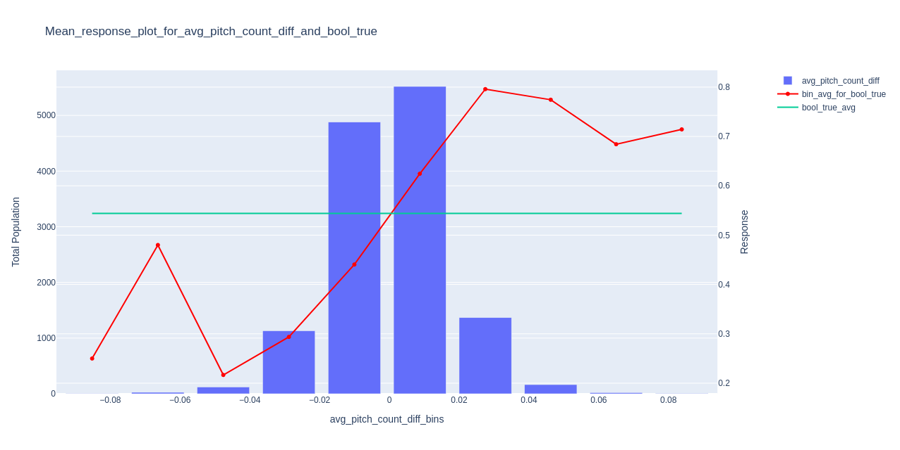
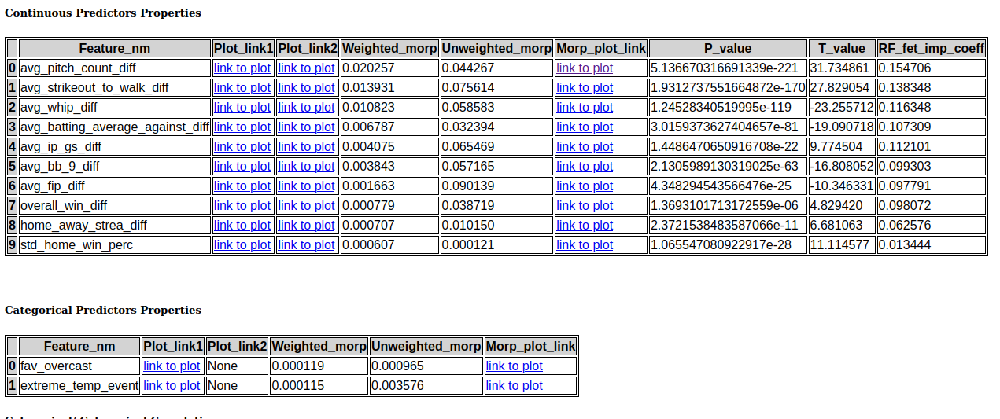
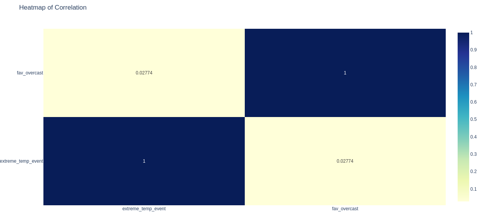
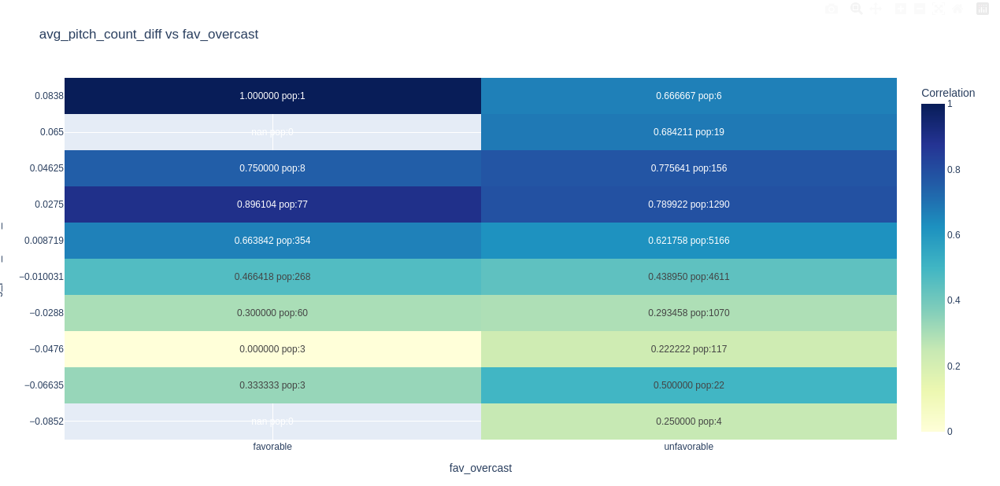
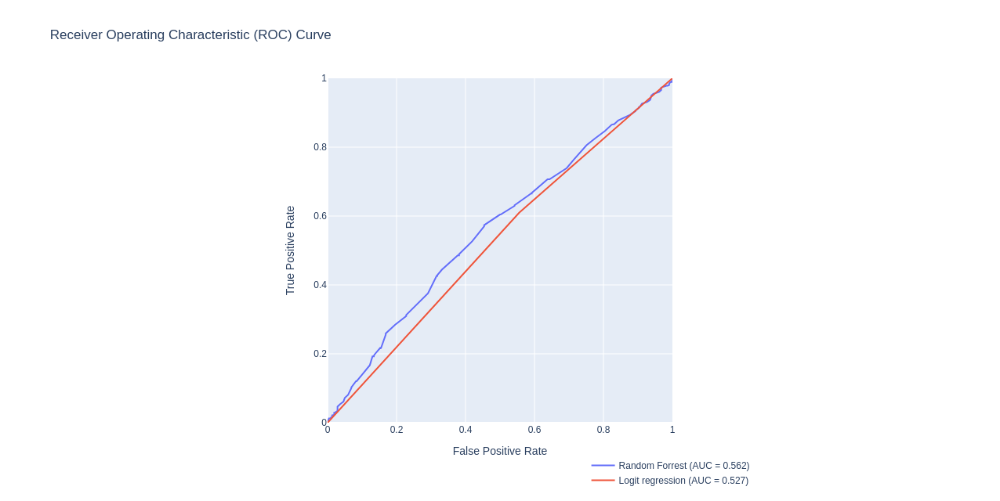
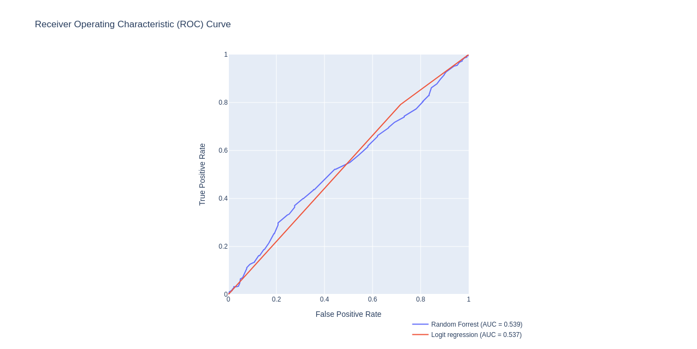
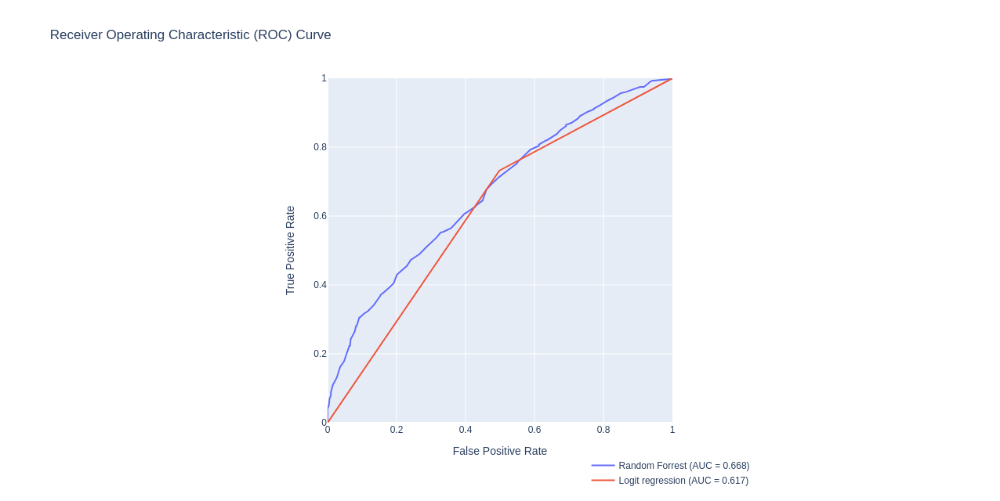
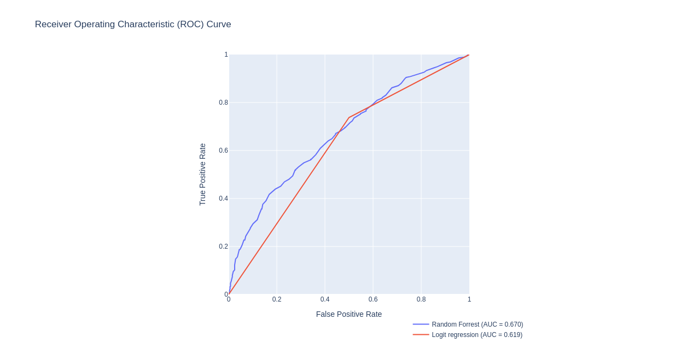

# BDA 602 MLE - Baseball match prediction with Machine Learning

# Environment setup:

- Set up a python 3.x venv (usually in `.venv`)
- You can run `./scripts/create-venv.sh` to generate one
- `pip3 install --upgrade pip`
- Install pip-tools `pip3 install pip-tools`
- Update dev requirements: `pip-compile --output-file=requirements.dev.txt requirements.dev.in`
- Update requirements: `pip-compile --output-file=requirements.txt requirements.in`
- Install dev requirements `pip3 install -r requirements.dev.txt`
- Install requirements `pip3 install -r requirements.txt`
- `pre-commit install`

# For updating requirements file

`pip-compile --output-file=requirements.dev.txt requirements.dev.in --upgrade`
`pip-compile --output-file=requirements.txt requirements.in --upgrade`

# Pre-commits for checking linting errors

`pre-commit run --all-files`

## Brief Overview

Aim: My intentions are to predict a baseball match based on actual historic baseball data! I would be predicting for the home team. The probablity or likelihood of away team winning can also be easily approximated from my model.

Dataset: I would be using a baseball dataset with match records between 2007 and 2012 (both inclusive). The dataset can be accessed by [clicking here](https://teaching.mrsharky.com/data/baseball.sql.tar.gz)
The dataset has over 30 tables with the base table being 'Innings' table. For any data issues feel free to reference the Innings table. ALl the other tables are derived from this. Some notable tables are:
Game, Boxscore, Pitcher_counts, Batter_counts, Team_results.

It has approximately 16000 records for different games between 2007 and 2012. There are different game types specified too like 'R' which is for Regular, 'E' for Exhibition.
I have only considered the Regular matches.

Issues with the dataset:

1. There are almost 1700 records in Boxscore table where the winning team does not have the maximum score. I made sure to overwrite the Winning team with right value.
2. Lots of Numeric column have Varchar data type. I made sure to change the data type before perfoming any operations.
3. A few confusing columns in the Pitcher_counts table like Flyout and Fly_outs.

Basic flow:

1. Set up a virtual environment with just basic libraries in my requirements file. Over the course of project all the essentials libraries were added to the requirements file.
2. The initial data analysis and exploration was done in SQL. This is where I discovered different data issues.
3. Did a lot of feature engineering in SQL! Most of my predictors/features were created for 100 rolling days before the match.
4. The features were then pulled into a Python environment where I had automated feature visualization and analysis. I automated the visualization process by generating a HTML reports were all the information about the features are available.
5. After feature generation and analysis, next step was to fit them to different Machine Learning models. I mainly used Random Forrest and Logistic Regression model. All the data before 2012 was used for training, the data past that was to be used for testing.
6. The whole project was containerized with Docker. And can be easily run on any environment with a simple docker-compose up command.

## Tools and Libraries Used

1. [Pycharm](https://www.jetbrains.com/pycharm/download/)
2. [Datagrip](https://www.jetbrains.com/datagrip/download/#section=linux)
3. [Mariadb](https://mariadb.org/download/)
4. SQL
5. [Python](https://www.python.org/downloads/) - Numpy, Pandas, sqlalchemy, sklearn, plotly, statsmodel, plotly, scipy etc.
6. [Docker](https://docs.docker.com/get-docker/)

# All about Feature Engineering

The idea behind feature engineering is to transform raw data into meaningful features or predictors which would make the relationship between our dependent and independent variables easier for the Machine Learning model to understand.
I created numerous features! Most of them are given below. There are a few which turned out useless and I have not mentioned them below.
These features are created at Pitcher level and Team level. All of my pitcher level features are calculated for all the matches in the last 100 days before the present match. Baseball is a streaky game! And historical features are generally not very helpful explaining the current form of the player.

I then took the ratio and difference of these predictors for home and away team! I realized taking the difference did a lot better than the earlier. When taking ratios if either of my player's features is zero then the whole predictor becomes zero and useless. I feel this is why difference did a lot better compared to ratio.

# Features developed

Standard baseball features:

Continuous features:

1. [Batting average against](https://en.wikipedia.org/wiki/Batting_average_against)
2. [Strikeout to walk ration](https://en.wikipedia.org/wiki/Strikeout-to-walk_ratio)
3. [Whip](https://en.wikipedia.org/wiki/Walks_plus_hits_per_inning_pitched)
4. [Fielding Independent Pitching](https://en.wikipedia.org/wiki/Defense_independent_pitching_statistics)
5. [BB_9](https://en.wikipedia.org/wiki/Bases_on_balls_per_nine_innings_pitched)
6. IP/GS – Average number of innings pitched per game started. Innings pitched was calculated as total no of wickets taken/3

Own Baseball features: Developed these features on my own. Based on any trend I could find.

Continuous features:

1. Pitch_count: Stole this from Cricket! It is analogous to [Bowling Strikerate](https://en.wikipedia.org/wiki/Strike_rate), which means no of wickets taken per ball. I calculated this as ratio of strikeout/pitches_thrown in baseball.
2. Overall_win_ratio: This is the total home and away win prior to the match the team has had divided by the total number of matches played.
3. Home_win_ratio: Ratio of matches the home team has won playing at home to the total matches played at home. Calculated it as home_wins/total_home_matches
4. Away_loss_ratio: Did this to understand how badly a team plays away from home. At the end of the day, I want to predict home team winning so this intutively will help my previous home_win_ratio feature. Calculated it as no of away matches lost to total away matches for the visiting team.
5. starting_pitch_home_w: This was done to understand how often does the home starting pitcher starts and his teams wins! I felt this could be a good predictor as in, you would want to start your best pitcher first. if the same pitcher keeps starting and his team keeps winning. Then he might be the secret to their success.
6. starting_pitch_home_w: This was calculated in a similar fashion to Away_loss_ratio. Calculated this as sum(no of times as startingpitcher and his team loses)/total_matches_played.
7. last_home_streak: No of matches the home_team has won/lost playing at home. This number would reset to zero whenever the team lost. Took this directly from the team_streaks table.
8. last_away_streak: No of matches the away_team has won/lost playing away from home. This number would reset to zero whenever the team lost.
9. last_home_ser_streak: No of matches the home_team has won/lost playing at home. This number is cumulative no of wins/losses at home.
10. last_away_ser_streak: No of matches the away_team has won/lost playing at home. This number is cumulative no of wins/losses away from home.
11. std_win_perc: I heard that there was a stadium in Mexico City at insane altitude where the away team would have a hard time acclimatizing. And home team would always have an upper hand. So, calculated historic win_percentage at the stadium of home team to understand the home_team advantage. This was calculated as no of matches won at home/total matches played at home for each stadium.
12. match_start_hour: This was just done to explore if there was a game start time which massively helped the home_team. Did not find any such relation.

Categorical features:

1. Extreme_temp_event: I feel extreme Heat or Cold would be an advantage for the home team. So, calculated a categorical field to understand weather there was an extreme temp event prevalent or not before starting. If the game temp was above 95F or below 38F then it was considered as an extreme event.
2. fav_overcast: Noticed that, games which had rain or dome had higher percentage of home team wins (58%) compared to the population mean of (51%). So, created a categorical feature which would be 'Favorable' if there was rain or dome overcast condition. And 'Unfavorable' otherwise.

Creating Categorical features kind of helped my Continuous features. I noticed that the P-value decreased for Continuous features in the logistic model summary.

Average of features at team level:

I noticed that my pitcher features were doing pretty poorly like Batting_average_against, whip, strikeout-to-walk ratio. To improve them I took the average of these features again at team level. And then used these for home and away team.
Be careful in calculating average using avg() as it would neglect null rows. You would be better off taking average as sum(feature_name)/count(\*) for each team.
This massively helped my model!

# Automated HTML report

The feature analysis and visualization is a boring and a long process.
One would have to iterate through multiple cycles of feature creation and analysis to find good features.
I automated the feature analysis part which massively reduced my time and headaches!
I created a python Report class that would return a HTML report with analysis of all the input features.

Below are the various components of the HTML report:

1. Mean of Response Plot:

This graph has three components. First being, the population mean of response which is then graphed as a straight line.
Second is, the predictor histogram distribution. The predictor is divided into 10 bins and no of samples in each bin are then plot as a histogram.
Lastly, mean of response in each bin of my predictor, which is then plotted as a line chart. Superimposing all these three graphs we get our Mean of response plot.

This graph is quite instrumental in understanding the relationship between predictor and response!

We can quantify the graphy by finding the Weighted and Unweighted difference with mean of response. Higher these value better would be my predictor!

2. p_value and t_value:

Using the logit model of Stats-model library p_value and t_value between each predictor and response is calculated independently. This is done to find good features which Correlate with response.
A good feature would have larger P-value less than 0.005 and absolute value of T-value greater than 2.5

3. Random Forest Variable Importance:

The importance of each feature in the data is determined by a random forest model, which assigns a weight to each feature based on how useful it is for making predictions. This is done by training the model on all the predictors, and the resulting feature ranking is used to guide further analysis or decision-making.

4. Categorical-Categorical Correlation Matrix and Brute Force Analysis:

Correlation Matrix between all the Categorical predictors is made with highly correlated columns at the very top. This way highly correlated columns can be found and filtered.
Calculated and mapped Tscuprow's and Cramers correlation between Categorical features.

Also created a 2-Dimensional Mean of response plot between my Categorical features. This was done in order to find any relationship between Categorical features.

5. Continuous-Continuous Correlation Matrix and Brute Force Analysis:

Correlation Matrix between all the Continuous predictors is made with highly correlated columns at the very top. This way highly correlated columns can be found and filtered.
Calculated and mapped Pearson's correlation between all the pairs of continuous features.

Also created a 2-Dimensional Mean of response plot between my continuous features. This was done in order to find any relationship between continuous features.

6. Continuous-Categorical Correlation Matrix and Brute Force Analysis:

Correlation Matrix between all the Continuous and Categorical predictors is made with highly correlated columns at the very top. This way highly correlated columns can be found and filtered.
Calculated and mapped correlation between all the pairs of continuous and categorical features.

Also created a 2-Dimensional Mean of response plot between my continuous and categorical features. This was done in order to find any relationship between continuous and categorical features.

# Model Evaluation

Feature data was divided into training and testing sets. With Any data beyond the year 2011 going into the testing set and the rest into training set.
Make sure not to blindly use train-test split as that would lead to random split between train and test and model being trained on future results or features.

Mainly used two Models: Random Forrest and Logistic Regression with different combinations of features.

Initial model by taking ratio between home and away features:

Initial model by taking difference between home and away features:

Model after adding categorical features:

Model after taking average at team level:

Model after taking average at team level:

